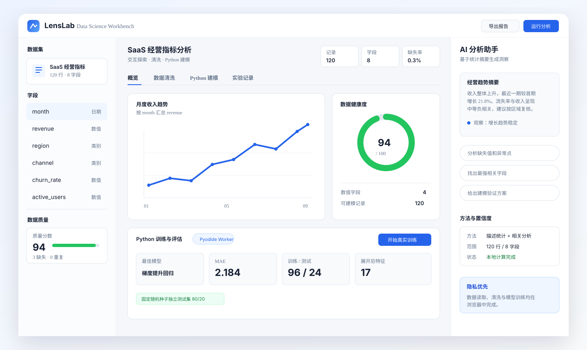
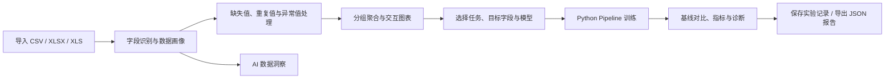

# LensLab — Data Science Workbench

<p align="center">
  <strong>在浏览器里完成数据导入、质量检查、探索分析、可视化与真实 Python 模型训练。</strong>
</p>

<p align="center">
  <a href="https://data-science-workbench.taotjd.chatgpt.site/"></a>
  <a href="https://github.com/osiris11111111/data-science-workbench/actions/workflows/ci.yml"></a>
  <a href="LICENSE"></a>
  
</p>

<p align="center">
  <a href="https://data-science-workbench.taotjd.chatgpt.site/"><strong>在线体验</strong></a>
  ·
  <a href="#本地运行">本地运行</a>
  ·
  <a href="#支持的模型与指标">模型与指标</a>
  ·
  <a href="#技术架构">技术架构</a>
</p>



> 上图根据当前产品界面绘制。LensLab 面向数据分析师与数据科学家，重点是把数据理解、清洗、建模和评估放在一套可复现的交互流程里。

## 为什么做 LensLab

常见的数据工作需要在表格工具、Notebook、可视化软件和聊天窗口之间反复切换。LensLab 将这些步骤整合到一个三栏工作台：

- 左侧管理数据集、字段类型与质量信息。
- 中间完成图表配置、清洗方案、建模与实验比较。
- 右侧提供基于统计摘要的 AI 洞察，避免把原始数据无边界地发送给模型。
- Python 训练在独立 Web Worker 中通过 Pyodide 运行，页面交互与计算相互隔离。

## 功能流程



## 核心能力

| 模块 | 已实现能力 |
| --- | --- |
| 数据导入 | CSV、XLSX、XLS；首个工作表解析；浏览器本地读取 |
| 数据画像 | 字段类型推断、缺失值、唯一值、重复记录、范围与均值 |
| 数据清洗 | 删除重复、文本去空格、删除缺失、均值/中位数/众数填补、IQR 缩尾 |
| 可视化 | 维度、指标、聚合方式与柱状图/折线图交互配置 |
| 分析助手 | 数据质量、相关性、趋势、分组分布与建模任务建议 |
| LLM 洞察 | 可选 OpenAI Responses API；服务端读取密钥；仅提交结构化摘要 |
| 模型训练 | Pyodide + pandas + scikit-learn，独立 Worker 中真实训练 |
| 模型评估 | 朴素基线、候选模型比较、Top 特征、残差图或混淆矩阵 |
| 实验管理 | 最近 30 次实验保存在浏览器 localStorage；支持 JSON 报告导出 |

## 支持的模型与指标

### 模型

| 任务 | 手动可选模型 | 自动选择规则 |
| --- | --- | --- |
| 回归 | 线性回归、岭回归、随机森林回归、直方图梯度提升回归 | 测试集 MAE 最低 |
| 分类 | 逻辑回归、随机森林分类、直方图梯度提升分类 | 测试集加权 F1 最高 |
| 时间顺序预测 | 线性趋势、岭回归趋势、随机森林预测、梯度提升预测 | 留后测试集 MAE 最低 |

### 评估指标

- 回归与预测：MAE、RMSE、R²，均值基线，真实值–预测值散点图，残差均值与标准差。
- 分类：Accuracy、Balanced Accuracy、Weighted F1，多数类基线，混淆矩阵。
- 所有任务：固定 `seed=42`，相同测试集上的基线比较，最多展示 10 个重要特征。
- 普通回归/分类使用固定随机种子 80/20 切分；预测任务按识别出的日期字段进行 80/20 时间留后切分。

### 防泄漏预处理

- 数值特征：训练集内中位数填补 + 标准化。
- 类别特征：训练集内众数填补 + One-Hot 编码，单字段最多 40 个类别。
- 唯一值比例超过 95% 的非数值字段自动排除，降低 ID 泄漏风险。
- 预处理与模型封装在同一 scikit-learn `Pipeline` 中，只在训练集拟合。

## 数据规模与当前边界

| 项目 | 当前限制 |
| --- | --- |
| 最少训练行数 | 去除目标缺失后至少 8 行 |
| 单次训练上限 | 前 5,000 行；超过时在结果中显示警告 |
| 诊断点数 | 散点、残差或分类样本最多保留 200 条 |
| 混淆矩阵 | 最多展示 8 个标签，低频类别合并为“其他” |
| 运行资源 | 受浏览器内存、CPU 和网络下载 Pyodide 包速度影响 |

当前版本定位为探索与原型验证工具。模型评估采用单次独立测试集；正式决策前应补充交叉验证。时间预测目前是单次留后评估，尚未加入滚动回测、季节性基线和概率区间。

## 技术架构

```mermaid
flowchart TB
    subgraph Browser[浏览器]
      UI[Next.js / React 工作台]
      Parser[CSV / SheetJS 解析]
      Profile[画像、清洗与图表]
      Worker[Web Worker]
      Py[Pyodide]
      ML[pandas + scikit-learn]
      Store[localStorage 实验记录]
      UI --> Parser --> Profile
      UI --> Worker --> Py --> ML
      UI --> Store
    end

    subgraph Server[Cloudflare / Vinext 服务端]
      Route[/api/llm]
      OpenAI[OpenAI Responses API]
      Route --> OpenAI
    end

    UI -->|统计摘要，可选| Route
```

主要技术：Next.js 16、React 19、TypeScript、Tailwind CSS 4、Recharts、SheetJS、Pyodide、pandas、scikit-learn、Vinext 与 Cloudflare Workers。

## 本地运行

### 环境要求

- Node.js `>=22.13.0`
- npm
- 首次使用 Python 建模时需要网络连接，以下载 Pyodide 与 Python 包

### 启动

```bash
git clone https://github.com/osiris11111111/data-science-workbench.git
cd data-science-workbench
npm ci
npm run dev -- --port 5177
```

打开 <http://127.0.0.1:5177/>。

Windows 也可以直接运行：

```powershell
powershell -ExecutionPolicy Bypass -File .\scripts\start-local.ps1
```

### 可选：启用 LLM 洞察

```bash
cp .env.example .env.local
```

然后在 `.env.local` 中设置：

```dotenv
OPENAI_API_KEY=your_key_here
OPENAI_MODEL=gpt-5.5
```

密钥只由服务端 API 路由读取；不要把 `.env.local` 提交到 Git。

## 验证与测试

每次推送和 Pull Request 都通过 GitHub Actions 执行：

```bash
npm ci
npm run lint
npm run build
```

CI 徽章展示当前 `main` 分支的实际结果。建模结果还会记录 Python、pandas 和 scikit-learn 版本、切分方式、样本数与随机种子，方便复核。

## 项目结构

```text
app/                         页面、样式与 LLM API
components/                  工作台与模型评估界面
lib/model-catalog.ts         任务与模型目录
public/python-worker.js      Pyodide / scikit-learn 训练后端
scripts/start-local.ps1      Windows 本地启动项
docs/                        产品界面资源
.github/workflows/ci.yml     持续集成
```

## 部署

当前在线版本：<https://data-science-workbench.taotjd.chatgpt.site/>

项目适配 Vinext 与 Cloudflare Workers。生产环境如需 LLM 洞察，应通过托管平台的 Secret/Environment Variables 配置 `OPENAI_API_KEY`，不要将密钥写入仓库。

## 路线图

- 滚动时间回测、季节性基线与预测区间
- 交叉验证、超参数搜索和实验筛选
- SHAP / permutation importance 等解释方法
- 更大的数据集采样与增量处理
- 实验结果导入、导出与团队共享

## License

本项目采用 [MIT License](LICENSE)。
